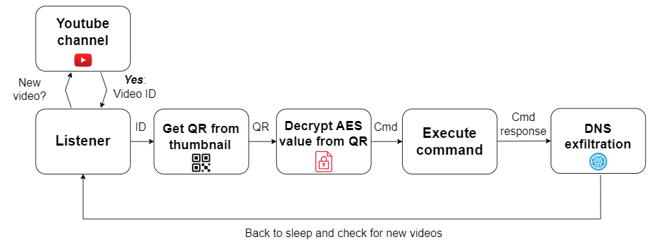

# Project Harvester

Project Harvester is a program created to control Linux systems remotely by uploading videos to Youtube.

The program monitors a Youtube channel until a video is uploaded, decodes the QR code from the thumbnail of the uploaded video and executes a command. The QR codes in the videos can use cleartext or AES-encrypted values.

